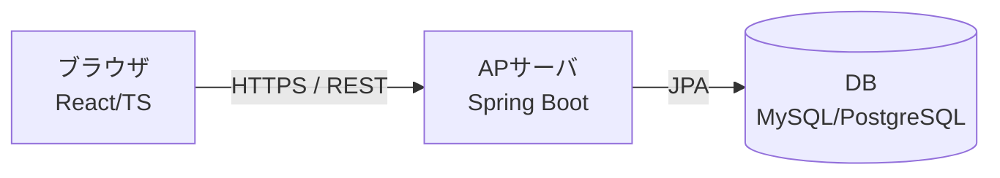
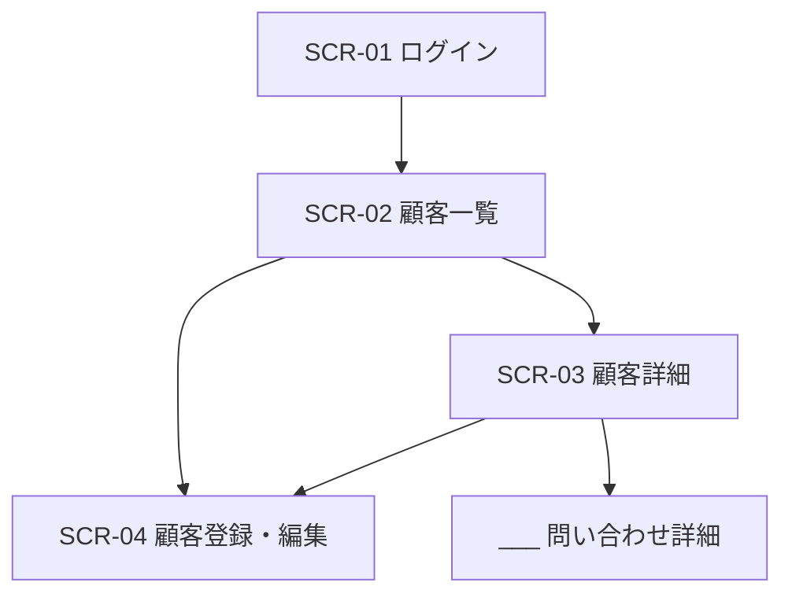
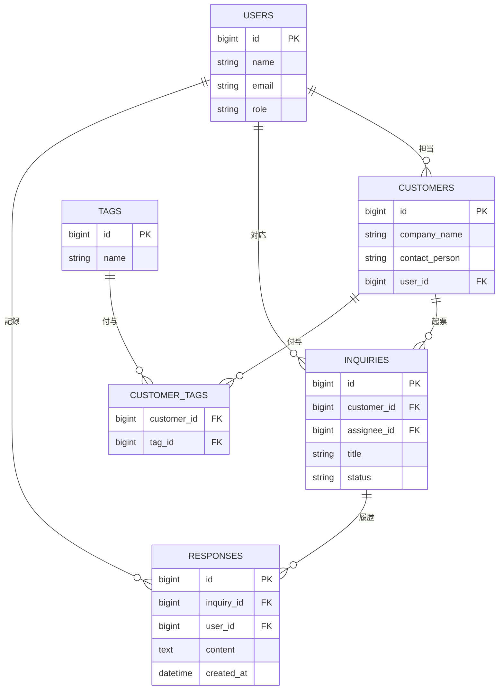

# 基本設計書 — 顧客管理CRM

| 項目 | 内容 |
|---|---|
| 文書バージョン | 0.1（ドラフト） |
| 作成日 | YYYY-MM-DD |
| 作成者 | （あなたの名前） |
| 関連文書 | 要件定義書 v0.1（RDD.md） |
| 更新履歴 | 0.1: 初版作成 |

> **この雛形の使い方**
> - 各章の冒頭にある「📝 書くこと」を読み、表やプレースホルダ `___` を埋めていきます。
> - 各章末尾の「← RDD」は、要件定義書のどこを材料にするかの対応です。迷ったらそこを開いてください。
> - 基本設計は「ユーザーから見える部分（外部設計）」を決める工程です。プログラムの内部処理は詳細設計に回します。
> - 章番号はこのまま目次になります。書く順番は自由ですが、4章（データ設計）が決まると他の章が書きやすくなります。

---

## 1. システム概要・全体構成

📝 **書くこと**：このシステムが何のためのものか（目的）と、全体像（3層構成の図）。

### 1.1 目的
`___`（要件定義書 1.2 の目的を1〜2文で要約。例：顧客情報と対応履歴を一元管理し、属人化を解消して対応品質と効率を上げる）

### 1.2 システム全体構成
本システムは以下の3層構成とする。

- フロントエンド：React + TypeScript（Vite / React Router / Tailwind CSS）
- バックエンド：Java + Spring Boot（Spring Web / Spring Data JPA / Spring Security）
- データベース：MySQL または PostgreSQL

← **RDD**：1.2 目的 / 6.3 技術的制約

---

## 2. 画面設計

📝 **書くこと**：どんな画面があり（一覧）、どう行き来し（遷移図）、各画面に何が並ぶか（項目）。

### 2.1 画面一覧
構成（RDD 2.1）と機能一覧（RDD 4.1）を突き合わせて、画面を洗い出す。

| 画面ID | 画面名 | 対応機能ID | アクセス権限 |
|---|---|---|---|
| SCR-01 | ログイン | F-001 | 全員 |
| SCR-02 | 顧客一覧 | F-006, F-019, F-020, F-021, F-022 | 全員 |
| SCR-03 | 顧客詳細 | F-007, F-018 | 全員 |
| SCR-04 | 顧客登録・編集 | F-003, F-004 | 営業／管理者 |
| SCR-05 | `___` | `___` | `___` |
| ... | `___` | `___` | `___` |

### 2.2 画面遷移図
どの画面からどの画面へ移動できるかを矢印で示す。

### 2.3 画面レイアウト・項目定義
画面ごとに、表示・入力項目を定義する（画面の数だけ繰り返す）。

#### SCR-02 顧客一覧
| 項目名 | 種別 | 必須 | 説明 |
|---|---|---|---|
| 検索キーワード | テキスト入力 | 任意 | 会社名・担当者名の部分一致（20文字以内） |
| ステータス絞込 | プルダウン | 任意 | 新規／対応中／保留／完了 |
| 顧客一覧テーブル | 表 | - | 会社名・担当者・最新ステータスを20件/ページで表示 |
| ページネーション | ボタン | - | 前へ／次へ |
| `___` | `___` | `___` | `___` |

#### SCR-03 顧客詳細
| 項目名 | 種別 | 必須 | 説明 |
|---|---|---|---|
| `___` | `___` | `___` | `___` |

← **RDD**：2.1 構成 / 4.1 機能一覧 / 4.2 機能詳細

---

## 3. 機能設計

📝 **書くこと**：各機能を「どの画面で・何を入力し・どう処理し・何を出すか」で表にする。RDD 4.2 の機能詳細をこの形に展開する。

| 機能ID | 機能名 | 画面ID | 入力 | 処理 | 出力 | 例外 |
|---|---|---|---|---|---|---|
| F-019 | キーワード検索 | SCR-02 | 会社名・担当者のキーワード | 部分一致検索／20件ずつ昇順 | 顧客一覧（会社名・担当者・ステータス） | 0件／未入力／20文字超 |
| F-005 | 顧客削除 | SCR-03 | 削除ボタン＋確認ダイアログ | 論理削除 | 「削除しました」表示 | キャンセル／二重削除／権限なし |
| F-003 | 顧客登録 | SCR-04 | `___` | `___` | `___` | `___` |
| ... | `___` | `___` | `___` | `___` | `___` | `___` |

← **RDD**：4.1 機能一覧 / 4.2 機能詳細

---

## 4. データベース設計（論理）  ※一緒に作成済み

📝 **書くこと**：エンティティ（テーブルの素）とその関連（ER図）、各テーブルの列定義。

### 4.1 ER図
RDD 1.3 用語定義・2.5 データスコープから抽出。`status` は「問い合わせ」の属性、タグは多対多のため中間テーブル `CUSTOMER_TAGS` を置く。

### 4.2 テーブル定義
ER図の各テーブルを、列ごとに定義する。下は記入例（CUSTOMERS）。残りのテーブルも同じ形式で `___` を埋める。

#### CUSTOMERS（顧客）
| 列名 | 型 | PK/FK | NOT NULL | 説明 |
|---|---|---|---|---|
| id | BIGINT | PK | ○ | 連番 |
| company_name | VARCHAR(100) | | ○ | 会社名 |
| contact_person | VARCHAR(50) | | | 担当者名 |
| user_id | BIGINT | FK→USERS.id | ○ | 担当営業 |
| is_deleted | BOOLEAN | | ○ | 論理削除フラグ（F-005対応） |
| created_at | DATETIME | | ○ | 登録日時 |

#### INQUIRIES（問い合わせ）
| 列名 | 型 | PK/FK | NOT NULL | 説明 |
|---|---|---|---|---|
| `___` | `___` | `___` | `___` | `___` |

#### RESPONSES（対応履歴）／ USERS ／ TAGS ／ CUSTOMER_TAGS
`___`（同様に定義する）

← **RDD**：1.3 用語定義 / 2.5 データスコープ

---

## 5. 外部インターフェース設計（REST API）

📝 **書くこと**：フロントとバックがやり取りするAPIを一覧にする。URL・メソッド・入出力をセットで。

| No | 機能 | メソッド | エンドポイント | 主なリクエスト | 主なレスポンス |
|---|---|---|---|---|---|
| 1 | ログイン | POST | /api/auth/login | email, password | トークン |
| 2 | 顧客一覧取得 | GET | /api/customers | page, keyword, status | 顧客配列＋件数 |
| 3 | 顧客登録 | POST | /api/customers | 顧客情報 | 作成された顧客 |
| 4 | `___` | `___` | `___` | `___` | `___` |

← **RDD**：追加要素「REST API設計」/ ページネーション・検索・ソート

---

## 6. 共通方式設計

📝 **書くこと**：全機能に共通する「やり方の方針」。各機能でいちいち書かずにここへまとめる。

- 認証・認可：`___`（RDD 5.5：パスワード8文字以上、ログイン3回失敗でロック、HTTPS必須／ロールは営業・サポート・管理者）
- 例外処理：`___`（追加要素「例外処理」：エラー時に返す形式・メッセージ方針）
- ログ：`___`（追加要素「構造化ログ」：何を・どの形式で・保管5年）
- 入力バリデーション：`___`（追加要素「入力バリデーション」：必須・桁数・文字種の方針）

← **RDD**：5.5 セキュリティ / 追加要素

---

## 7. 非機能設計

📝 **書くこと**：RDD 5章の非機能要件を「どう実現するか」に翻訳する。

| 区分 | 要件（RDD 5章） | 実現方式 |
|---|---|---|
| 性能 | 検索・画面表示3秒以内 | `___`（例：検索列にインデックス、ページネーション） |
| 可用性 | 稼働率99.5%、復旧2時間以内 | `___` |
| 拡張性 | 同時17人→30人 | `___` |
| 運用・保守 | 日次バックアップ、ログ5年 | `___` |
| セキュリティ | HTTPS、ロック、論理削除 | `___` |

← **RDD**：5章すべて

---

## 付録

- 関連文書：要件定義書（RDD.md）
- 参考：IPA 非機能要求グレード