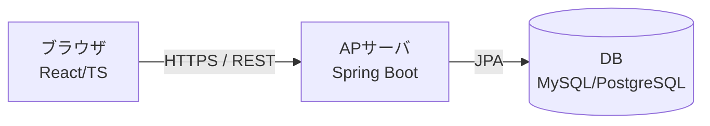
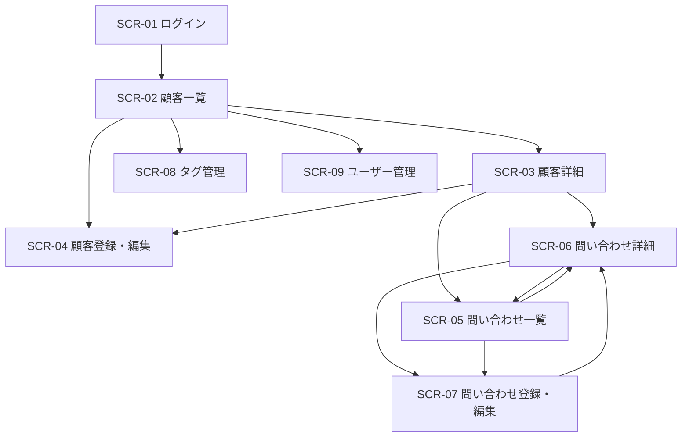
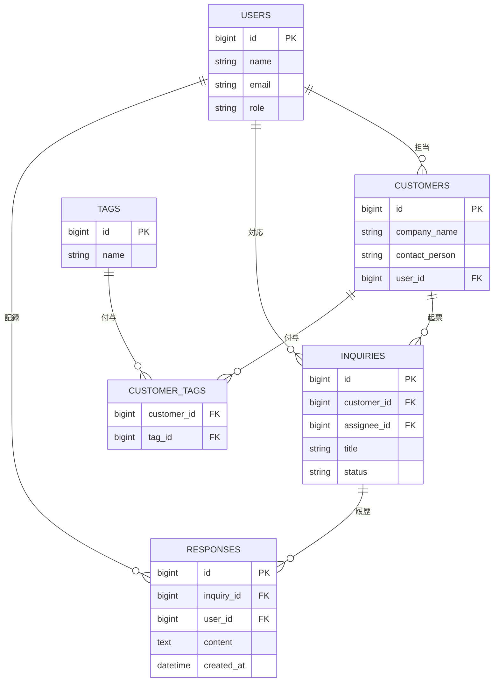

# 基本設計書 — 顧客管理CRM

| 項目 | 内容 |
|---|---|
| 文書バージョン | 0.1（ドラフト） |
| 作成日 | YYYY-MM-DD |
| 作成者 | （あなたの名前） |
| 関連文書 | 要件定義書 v0.1（RDD.md） |
| 更新履歴 | 0.1: 初版作成 |

> **この雛形の使い方**
> - 各章の冒頭にある「📝 書くこと」を読み、表やプレースホルダ `___` を埋めていきます。
> - 各章末尾の「← RDD」は、要件定義書のどこを材料にするかの対応です。迷ったらそこを開いてください。
> - 基本設計は「ユーザーから見える部分（外部設計）」を決める工程です。プログラムの内部処理は詳細設計に回します。
> - 章番号はこのまま目次になります。書く順番は自由ですが、4章（データ設計）が決まると他の章が書きやすくなります。

---

## 1. システム概要・全体構成

📝 **書くこと**：このシステムが何のためのものか（目的）と、全体像（3層構成の図）。

### 1.1 目的
顧客情報と対応履歴を一元管理し、属人化を解消して対応品質と効率を上げる

### 1.2 システム全体構成
本システムは以下の3層構成とする。

- フロントエンド：React + TypeScript（Vite / React Router / Tailwind CSS）
- バックエンド：Java + Spring Boot（Spring Web / Spring Data JPA / Spring Security）
- データベース：MySQL または PostgreSQL



← **RDD**：1.2 目的 / 6.3 技術的制約

---

## 2. 画面設計

📝 **書くこと**：どんな画面があり（一覧）、どう行き来し（遷移図）、各画面に何が並ぶか（項目）。

### 2.1 画面一覧
構成（RDD 2.1）と機能一覧（RDD 4.1）を突き合わせて、画面を洗い出す。

| 画面ID | 画面名 | 対応機能ID | アクセス権限 |
|---|---|---|---|
| SCR-01 | ログイン | F-001 | 全員 |
| SCR-02 | 顧客一覧 | F-006, F-019, F-020, F-021, F-022, F-024, F-026, F-027 | 全員（CSV入出力ボタンは管理者のみ） |
| SCR-03 | 顧客詳細 | F-007, F-018, F-025 | 全員 |
| SCR-04 | 顧客登録・編集 | F-003, F-004 | 営業 |
| SCR-05 | 問い合わせ一覧 | F-010, F-013, F-019, F-020, F-021 | 全員 |
| SCR-06 | 問い合わせ詳細 | F-011, F-012, F-013 | 全員 |
| SCR-07 | 問い合わせ登録・編集 | F-008, F-009, F-014 | 営業/カスタマーサポート |
| SCR-08 | タグ管理 | F-015, F-016, F-017 | 管理者 |
| SCR-09 | ユーザー管理・ロック解除 | F-023 | 管理者 |

### 2.2 画面遷移図
どの画面からどの画面へ移動できるかを矢印で示す。



### 2.3 画面レイアウト・項目定義
画面ごとに、表示・入力項目を定義する（画面の数だけ繰り返す）。

#### SCR-02 顧客一覧
| 項目名 | 種別 | 必須 | 説明 |
|---|---|---|---|
| 検索キーワード | テキスト入力 | 任意 | 会社名・担当者名の部分一致（20文字以内） |
| ステータス絞込 | プルダウン | 任意 | 新規／対応中／保留／完了 |
| 顧客一覧テーブル | 表 | - | 会社名・担当者・最新の問い合わせのステータスを20件/ページで表示 |
| ページネーション | ボタン | - | 前へ／次へ |
| 新規登録ボタン | ボタン | - | SCR-04（顧客登録）へ遷移。営業のみ表示 |
| CSVインポート | ボタン＋ファイル選択 | - | CSVから顧客を一括新規登録（F-026）。管理者のみ表示 |
| CSVエクスポート | ボタン | - | 現在の検索・絞込結果をCSV出力（F-027）。管理者のみ表示 |

#### SCR-03 顧客詳細
| 項目名 | 種別 | 必須 | 説明 |
|---|---|---|---|
| 会社情報 | テキスト | - | 会社名・担当者・担当営業・登録日時 |
| タグ表示 | 表示 | - | この顧客に付与されたタグ一覧（F-018）。全員表示 |
| タグ付与・解除 | ボタン | - | この顧客へのタグ付与/解除（F-018、CUSTOMER_TAGSを操作）。営業のみ表示 |
| 会社編集 | ボタン | - | SCR-04(顧客編集)へ遷移。営業のみ表示 |
| 担当者変更 | ボタン | - | 担当営業の付け替え(F-025、CUSTOMERS.user_idを更新)。営業/管理者のみ表示 |
| 会社削除 | ボタン | - | 確認ダイアログ→論理削除(is_deleted、F-005)。管理者のみ表示 |
| 顧客の問い合わせ一覧 | ボタン | - | 当該顧客で絞り込んだ状態のSCR-05(問い合わせ一覧)へ遷移 |

← **RDD**：2.1 構成 / 4.1 機能一覧 / 4.2 機能詳細

---

## 3. 機能設計

📝 **書くこと**：各機能を「どの画面で・何を入力し・どう処理し・何を出すか」で表にする。RDD 4.2 の機能詳細をこの形に展開する。

| 機能ID | 機能名 | 画面ID | 入力 | 処理 | 出力 | 例外 |
|---|---|---|---|---|---|---|
| F-019 | キーワード検索 | SCR-02 | 会社名・担当者のキーワード | 部分一致検索／20件ずつ昇順 | 顧客一覧（会社名・担当者・ステータス） | 0件／未入力／20文字超 |
| F-005 | 顧客削除 | SCR-03 | 削除ボタン＋確認ダイアログ | 論理削除 | 「削除しました」表示 | キャンセル／二重削除／権限なし |
| F-003 | 顧客登録 | SCR-04 | 会社名(必須)・担当者名・担当営業 | バリデーション→INSERT | 「登録しました」表示→顧客詳細(SCR-03)へ | 必須未入力/桁数超過/入力形式・文字種 |
| F-008 | 問い合わせ登録 | SCR-07 | 顧客(customer_id)・タイトル・担当者 | バリデーション→INSERT | 「登録しました」表示→問い合わせ詳細(SCR-06)へ | 必須未入力/桁数超過 |
| F-001 | ログイン | SCR-01 | email・password | password_hashとbcrypt照合→JWT発行 | ログイン成功→顧客一覧(SCR-02)へ | 認証失敗(401)／3回失敗でロック(6章) |
| F-002 | ログアウト | 全画面 | ログアウト操作 | トークンをブラックリストに登録し失効 | ログイン(SCR-01)へ | （共通は6章） |
| F-004 | 顧客編集 | SCR-04 | 会社名(必須)・担当者名 | 取得→バリデーション→UPDATE | 「更新しました」表示→顧客詳細(SCR-03)へ | 必須未入力/桁数超過/入力形式・文字種/対象なし=404/二重更新 |
| F-006 | 顧客一覧 | SCR-02 | ページ番号（検索/絞込はF-019/F-020） | 論理削除を除外し20件/頁で取得 | 顧客一覧（会社名・担当者・最新ステータス） | 0件 |
| F-007 | 顧客詳細 | SCR-03 | 顧客ID(URL) | 1件取得（タグ含む） | 顧客詳細（会社情報・タグ） | 対象なし(404、6章) |
| F-009 | 問い合わせ編集 | SCR-07 | 問い合わせID＋変更項目 | バリデーション→UPDATE | 「更新しました」→問い合わせ詳細へ | 必須未入力/桁数超過/対象なし(404)/競合 |
| F-010 | 問い合わせ一覧 | SCR-05 | 顧客ID or 絞込・ページ番号 | 論理削除除外で20件/頁取得 | 問い合わせ一覧 | 0件 |
| F-011 | 問い合わせ詳細 | SCR-06 | 問い合わせID(URL) | 1件取得 | 問い合わせ詳細 | 対象なし(404) |
| F-012 | 対応登録 | SCR-06 | 問い合わせID・対応内容(content) | バリデーション→INSERT | 「登録しました」→対応履歴に追加表示 | 必須未入力 |
| F-013 | 対応閲覧 | SCR-06 | 問い合わせID | 対応履歴を時系列取得 | 対応履歴一覧 | 0件 |
| F-014 | ステータス管理 | SCR-07 | 新ステータス（新規/対応中/保留/完了） | inquiries.statusをUPDATE | 更新後ステータス表示 | 不正な値/対象なし(404) |
| F-015 | タグ作成 | SCR-08 | タグ名 | バリデーション→INSERT | 「作成しました」→タグ一覧に追加 | 必須未入力/桁数超過/名称重複(409) |
| F-016 | タグ編集 | SCR-08 | タグID・新タグ名 | バリデーション→UPDATE | 「更新しました」 | 必須未入力/名称重複(409)/対象なし(404) |
| F-017 | タグ削除 | SCR-08 | タグID＋確認ダイアログ | 削除（CUSTOMER_TAGSの関連も考慮） | 「削除しました」 | キャンセル/対象なし(404) |
| F-018 | タグの顧客付与 | SCR-03 | 顧客ID・タグ | 付与=CUSTOMER_TAGSにINSERT／解除=DELETE | タグ表示を更新 | 重複付与/対象なし(404) |
| F-020 | ステータス絞込 | SCR-02/05 | ステータス選択 | statusで絞り込み | 絞込後の一覧 | 0件 |
| F-021 | ソート | SCR-02/05 | ソート項目 | 指定項目で昇順ソート | 並び替え後の一覧 | （特になし） |
| F-022 | ページネーション | SCR-02/05 | ページ番号 | offset/limitで20件取得 | 該当ページの一覧＋総件数 | 範囲外ページ |
| F-023 | ユーザー管理 | SCR-09 | ユーザー情報(name/email/role)・操作 | 登録=INSERT／編集=UPDATE／ロック解除=locked解除 | ユーザー一覧・操作結果 | 必須未入力/メール重複(409)/対象なし(404) |
| F-024 | 画面内バッジ表示 | SCR-02ほか | （自動。入力なし） | 未対応（対応中/保留）件数を集計 | アイコンにバッジ数値を表示 | （特になし） |
| F-025 | 担当者変更 | SCR-03 | 新しい担当営業のuser_id | customers.user_idをUPDATE | 担当営業の表示を更新 | 不正なuser_id/対象なし(404) |
| F-026 | 顧客CSVインポート | SCR-02 | CSVファイル（UTF-8/ヘッダ行あり） | 全行バリデーション→1トランザクションで一括INSERT（新規追加のみ） | 「○件登録しました」＋取込件数 | ファイル未選択/空/CSV形式不正(400)/不正行ありで全件中止＝エラー行を返す(400) |
| F-027 | 顧客CSVエクスポート | SCR-02 | 検索キーワード・ステータス絞込（任意） | 論理削除を除外し条件一致の顧客を全件抽出→CSV生成 | CSVファイルのダウンロード | （該当0件でもヘッダのみのCSVを返す） |

← **RDD**：4.1 機能一覧 / 4.2 機能詳細

---

## 4. データベース設計（論理）  ※一緒に作成済み

📝 **書くこと**：エンティティ（テーブルの素）とその関連（ER図）、各テーブルの列定義。

### 4.1 ER図
RDD 1.3 用語定義・2.5 データスコープから抽出。`status` は「問い合わせ」の属性、タグは多対多のため中間テーブル `CUSTOMER_TAGS` を置く。



### 4.2 テーブル定義
ER図の各テーブルを、列ごとに定義する。下は記入例（CUSTOMERS）。残りのテーブルも同じ形式で `___` を埋める。

#### CUSTOMERS（顧客）
| 列名 | 型 | PK/FK | NOT NULL | 説明 |
|---|---|---|---|---|
| id | BIGINT | PK | ○ | 連番 |
| company_name | VARCHAR(100) | | ○ | 会社名 |
| contact_person | VARCHAR(50) | | | 担当者名 |
| user_id | BIGINT | FK→USERS.id | ○ | 担当営業 |
| is_deleted | BOOLEAN | | ○ | 論理削除フラグ（F-005対応） |
| created_at | DATETIME | | ○ | 登録日時 |
| updated_at | DATETIME | | ◯ | 更新日時（楽観ロック用。F-004/F-009の競合(409)検知） |

#### INQUIRIES（問い合わせ）
| 列名 | 型 | PK/FK | NOT NULL | 説明 |
|---|---|---|---|---|
| id | BIGINT | PK | ◯ | 連番 |
| customer_id | BIGINT | FK→CUSTOMERS.id | ◯ | 顧客ID |
| assignee_id | BIGINT | FK→USERS.id | ◯ | 担当者ID |
| title | VARCHAR(100) |  | ◯ | タイトル |
| status | VARCHAR(25) |  | ◯ | ステータス。DEFAULT「新規」 |
| is_deleted | BOOLEAN |  | ◯ | 問い合わせの情報を論理削除する |
| created_at | DATETIME |  | ◯ | 問い合わせの情報を登録する |
| updated_at | DATETIME | | ◯ | 更新日時（F-009の競合検知用） | |

#### RESPONSES（対応履歴）
| 列名 | 型 | PK/FK | NOT NULL | 説明 |
|---|---|---|---|---|
| id | BIGINT | PK | ◯ | 対応履歴のID |
| inquiry_id | BIGINT | FK→INQUIRIES.id | ◯ | 問い合わせのID |
| user_id | BIGINT | FK→USERS.id | ◯ | 記録者ID |
| content | TEXT |  | ◯ | メモ |
| created_at | DATETIME |  | ◯ | 対応履歴の登録 |

#### USERS(ユーザー)
| 列名 | 型 | PK/FK | NOT NULL | 説明 |
|---|---|---|---|---|
| id | BIGINT | PK | ◯ | ユーザーID |
| name | VARCHAR(50) |  | ◯ | 営業担当者 |
| email | VARCHAR(255) |  | ◯ | 一意(UNIQUE)にしたい |
| role | VARCHAR(20) |  | ◯ | 営業/サポート/管理者の3択 |
| is_deleted | BOOLEAN |  | ◯ | 退職した担当者を論理削除扱いにする |
| password_hash | VARCHAR(255) |  | ◯ | 平文NG。 |
| locked | BOOLEAN |  | ◯ | 3回間違えたら、ロックする |
| failed_login_count | INT |  |  ◯ | DEFAULT 0。３回失敗でロックを実装するには、現在の失敗回数をカウントする必要がある |
| created_at | DATETIME |  | ◯ | CUSTOMERSにもあるため |

#### TAGS(タグ)
| 列名 | 型 | PK/FK | NOT NULL | 説明 |
|---|---|---|---|---|
| id | BIGINT | PK | ◯ | タグのID |
| name | VARCHAR(50) |  | ◯ | タグの名前。一意(UNIQUE)にしたい |

#### CUSTOMER_TAGS(顧客タグ)
| 列名 | 型 | PK/FK | NOT NULL | 説明 |
|---|---|---|---|---|
| customer_id | BIGINT | PK, FK→CUSTOMERS.id | ◯ | 顧客ID、複合PK |
| tag_id | BIGINT | PK, FK→TAGS.id | ◯ | タグのID、複合PK |

← **RDD**：1.3 用語定義 / 2.5 データスコープ

---

## 5. 外部インターフェース設計（REST API）

📝 **書くこと**：フロントとバックがやり取りするAPIを一覧にする。URL・メソッド・入出力をセットで。

| No | 機能 | メソッド | エンドポイント | 主なリクエスト | 主なレスポンス |
|---|---|---|---|---|---|
| 1 | ログイン | POST | /api/auth/login | email, password | トークン |
| 2 | ログアウト | POST | /api/auth/logout | トークン | ログアウト成功のメッセージ |
| 3 | 顧客一覧取得 | GET | /api/customers | page, keyword, status | 顧客配列＋件数 |
| 4 | 顧客登録 | POST | /api/customers | 顧客情報 | 作成された顧客 |
| 5 | 顧客詳細取得 | GET | /api/customers/{customerId} | (URLのid) | 顧客の詳細情報 |
| 6 | 顧客編集 | PUT | /api/customers/{customerId} | 顧客情報の変更を依頼 | 顧客情報を変更 |
| 7 | 顧客削除 | DELETE | /api/customers/{customerId} | 顧客情報の削除要請 | 顧客情報を削除 |
| 8 | 問い合わせ一覧取得 | GET | /api/customers/{customerId}/inquiries | 対応する顧客の問い合わせ履歴 | 問い合わせ配列 |
| 9 | 問い合わせ登録 | POST | /api/customers/{customerId}/inquiries | 対応する顧客の問い合わせ情報 | 作成された顧客問い合わせ |
| 10 | 問い合わせ詳細取得 | GET | /api/inquiries/{inquiryId} | (inquiriesのid) | 顧客問い合わせの詳細情報 |
| 11 | 問い合わせ編集 | PUT | /api/inquiries/{inquiryId} | 顧客問い合わせの変更を依頼 | 顧客問い合わせの変更 |
| 12 | 対応履歴詳細取得 | GET | /api/inquiries/{inquiryId}/responses/{responseId} | (responsesのid) | 対応履歴の詳細情報 |
| 13 | 対応履歴登録 | POST | /api/inquiries/{inquiryId}/responses | 対応履歴情報 | 作成された対応履歴 |
| 14 | 対応閲覧(一覧) | GET | /api/inquiries/{inquiryId}/responses | 問い合わせID | 対応履歴の配列 |
| 15 | タグ一覧取得 | GET | /api/tags |  | タグの配列 |
| 16 | タグ編集 | PUT | /api/tags/{tagId} | タグ情報の変更要請 | タグ情報の変更 |
| 17 | タグ削除 | DELETE | /api/tags/{tagId} | タグ情報の削除要請 | タグ情報の削除 |
| 18 | タグ作成 | POST | /api/tags | タグ情報 | 作成されたタグ情報 |
| 19 | タグ解除 | DELETE | /api/customers/{customerId}/tags/{tagId} | 顧客のタグ解除要請 | 顧客のタグの解除 |
| 20 | 付与 | POST | /api/customers/{id}/tags/{tagId} | 顧客のタグ付与要請 | 顧客のタグ付与 |
| 21 | ユーザー管理一覧 | GET | /api/users | page, keyword, ユーザー名 | ユーザーの配列 |
| 22 | ユーザー管理登録 | POST | /api/users | ユーザー情報 | 作成されたユーザー情報 |
| 23 | ユーザー管理変更 | PUT | /api/users/{userId} | 退職者含むユーザーID | ユーザーの変更 |
| 24 | ロック解除 | PUT | /api/users/{userId}/unlock | ユーザーID | ユーザーのロック解除 |
| 25 | 担当者変更 | PUT | /api/customers/{customerId}/assignee | 新しい担当営業のuser_id | 担当営業を変更（F-025、営業/管理者のみ） |
| 26 | 問い合わせ一覧取得(横断) | GET | /api/inquiries | page, keyword, status | 問い合わせ配列＋件数（顧客を跨いだ一覧。SCR-05・F-010用） |
| 27 | 顧客CSVインポート | POST | /api/customers/import | multipart/form-data（CSVファイル） | 取込件数。不正行ありは400＋エラー行配列（全件ロールバック、F-026、管理者のみ） |
| 28 | 顧客CSVエクスポート | GET | /api/customers/export | keyword, status | text/csv（顧客一覧、F-027、管理者のみ） |

> 対応履歴（RESPONSES）は追記のみ（登録・閲覧）とし、編集・削除APIは設けない。RDD S-04のスコープに合わせ、履歴の改ざんを防ぐ。

### 5.2 CSVファイルレイアウト（顧客インポート/エクスポート）
No.27/28 で授受するCSVの列定義。文字コードはUTF-8、1行目はヘッダ固定とする。
インポートは「新規追加のみ」のため、`id`・`created_at` 等のシステム採番列は受け取らない（無視する）。

| No | 列名（ヘッダ） | 必須 | 形式・制約 | 対応カラム |
|---|---|---|---|---|
<!-- TODO(human): 顧客インポート/エクスポートのCSV列を定義する。4.2 CUSTOMERSテーブルを基準に、
     どの列をCSVに含めるか・必須か・担当営業をどう表現するか・会社名重複をどう扱うかを埋める。 -->

← **RDD**：追加要素「REST API設計」/ ページネーション・検索・ソート

---

## 6. 共通方式設計

📝 **書くこと**：全機能に共通する「やり方の方針」。各機能でいちいち書かずにここへまとめる。

- 認証・認可：
  1. 認証方式
  - JWT(トークン方式)、ブラックリスト(失効済みトークン一覧)を持つ(詳細設計にて)
  - 24時間で失効
  - HTTPS必須
  2. 認可
   - ロールは営業担当者/カスタマーサポート/管理者の３つ。
    - 権限(全アクター除く)
     1. 営業担当者: 顧客登録・編集、担当者割当・変更、問い合わせ登録、編集、対応登録、ステータス管理、タグ付与、画面内バッジ
     2. カスタマーサポート: 問い合わせ登録・編集、対応登録、ステータス管理、画面内バッジ
     3. 管理者: 顧客削除、タグ作成・編集・削除、ユーザー管理、担当者割当・変更
   - ロールベースでAPI層を制御
  3. パスワード・アカウントロック
   - ハッシュ化でbcrypt
   - 3回失敗でロック(USERSのfailed_login_count/locked)
   - 失敗時は「メールアドレスまたはパスワードが正しくありません。もう一度入力してください。」
   - 成功時は、「ログインしました。」
   - ロック解除は管理者のみ

- 例外処理：
 1. レスポンス形式(全APIのエラーは下記JSONに統一)
  ```json
  {                                                                             
    "timestamp": "2026-06-14T10:00:00Z",
    "status": 400,                                                              
    "error": "Bad Request",                                                   
    "message": "会社名は必須です",                                              
    "path": "/api/customers"      
  }
  ```
 1. ステータスコード
  | ステータスコード | エラー詳細 |
  |--|--|
  | 400 | バリデーションエラー(必須なし、桁数超過) |
  | 401 | 未認証(トークン無し/失効、ログイン失敗) |
  | 403 | 権限なし |
  | 404 | 対象なし(存在しないID) |
  | 409 | 競合(二重削除、メール重複) |
  | 500 | 想定外エラー |
 1. メッセージ方針
   - ユーザー向け: 内部情報(SQL・スタックトレース・どの項目か等)は出さず、平易な文言にする。
   - ログ向け: スタックトレース等の詳細を記録する(→ログ項目と連携)
   - 各コードの文例は下記:
     - 400: 必須項目に入力エラーが発生しました。
     - 401: ログイン失敗しました。
     - 403: 管理者にお問い合わせください。
     - 404: 一覧画面に戻る。
     - 409: 競合してます。
     - 500: エラーが発生しました。

- ログ：
  1. 何を記録するか
    - アクセスログ: 各アクターが入った日時に成功/失敗とHTTPステータスを記録
    - エラーログ: 
     1. 400: バリデーションエラー
     2. 401: 未認証
     3. 403: 権限なし
     4. 404: 対象なし
     5. 409: 競合
     6. 500: 想定外エラー
    - 監査ログ: 顧客削除・ユーザー作成/変更・ロック解除・ログイン成否
  2. 形式
    - RDDが「構造化ログ」要求→JSON形式
    - 例: 
    ```json
      {
        "time": "2026-06-14T10:00:00Z",
        "level": "INFO",
        "userId": "12",
        "action": "DELETE_CUSTOMER",
        "path": "/api/customers/5"
      }
    ```
  3. ログレベルの使い分け
   - ERROR(想定外の障害)/WARN(異常だが継続可)/INFO(通常操作の記録)/DEBUG(開発時のみ)
   - INFO以上(DEBUGは開発時のみ)
  4. 保管
   - RDD「5年」

  **セキュリティ上の必須事項:**
   - **パスワード・トークン・パスワードハッシュは絶対にログに出さない**(漏洩したら認証情報が流出する)

- 入力バリデーション：
  1. どこでチェックするか(最重要の設計判断)
    - フロント/バック。バックを正とする。
        - フロント: 即時エラー表示でUX向上(ただし改ざん可能で信用しない)
        - バック: 最後の砦。直接APIを叩かれても守るため必須→バックを正とする
  2. 何をチェックするか
    - 必須: NOT NULLの項目(company_name, email, title など)が空でないこと
    - 桁数: 
      VARCHAR(n): company_name<=100, email<=255, user_name<=100, 
    - 文字種・形式(emailはメール形式、検索キーワードは20文字以内)
  3. テーブル定義との整合
    - 4章のテーブル定義の桁数・NOT NULLをバリデーションルールの基準とする
  4. エラーの返し方
    - 例外処理で定めた400 + 統一JSON形式で返す
    - 複数項目が同時にエラーなら
        ```json
            {
                "errors": [
                    { "field": "company_name", "message": "会社名は必須です" },
                    { "field": "email", "message": "メール形式が不正です" }
                ]
            }
        ```
      のような配列で全部返す

← **RDD**：5.5 セキュリティ / 追加要素

---

## 7. 非機能設計

📝 **書くこと**：RDD 5章の非機能要件を「どう実現するか」に翻訳する。

| 区分 | 要件（RDD 5章） | 実現方式 |
|---|---|---|
| 性能 | 検索・画面表示3秒以内 | 検索対象列（company_name, status等）にインデックスを付与。一覧は20件/ページのページネーション（5章）で取得件数を制限 |
| 可用性 | 稼働率99.5%、復旧2時間以内 | アプリ・DBの死活監視。日次バックアップからの復元手順を整備し、障害時は2時間以内に復旧 |
| 拡張性 | 同時17人→30人 | JWTによるステートレス設計（6章）でサーバ側に状態を持たず、APサーバの台数追加（スケールアウト）で同時接続増に対応 |
| 運用・保守 | 日次バックアップ、ログ5年 | 日次でDBバックアップ<br>世代管理<br>ログは6章方針に従いJSON構造化で5年保管 |
| セキュリティ | HTTPS、ロック、論理削除 | HTTPS必須(6章)<br>3回失敗でロック(6章)<br>論理削除(4章) |

← **RDD**：5章すべて

---

## 付録

- 関連文書：要件定義書（RDD.md）
- 参考：IPA 非機能要求グレード