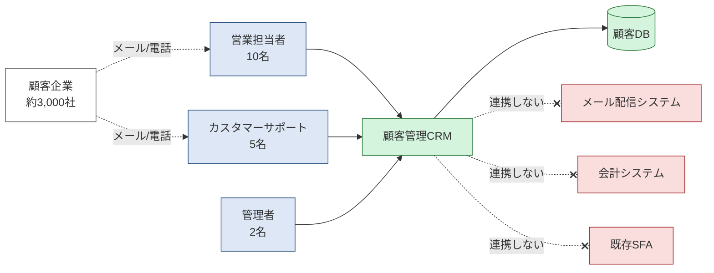
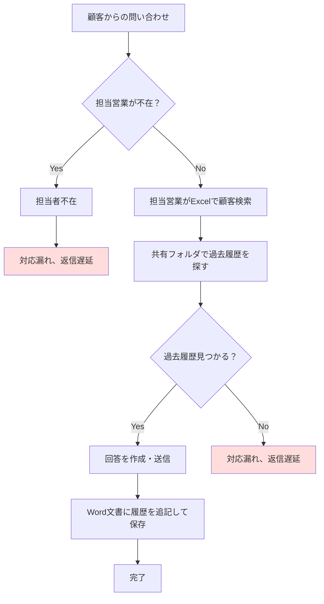
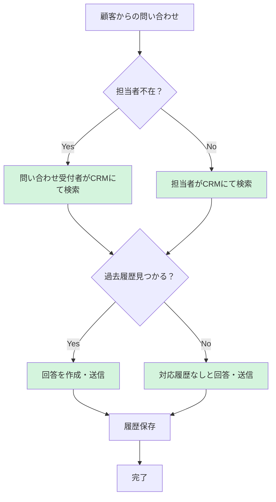

# 顧客管理CRM 要件定義書

| 項目 | 内容 |
|---|---|
| 文書バージョン | 0.1（ドラフト） |
| 作成日 | YYYY-MM-DD |
| 作成者 | （あなたの名前） |
| 更新履歴 | 0.1: 初版作成 |

---

## 1. はじめに

### 1.1 背景

株式会社サンプル商事（従業員50名、BtoBオフィス用品販売）では、約3,000社の法人顧客を抱え、月間約200件の問い合わせ対応を行っている。現在の顧客管理および問い合わせ対応は以下の方法で運用されている。

- 顧客情報：Excel台帳（顧客マスタ.xlsx）で一元管理
- 問い合わせ受付：各営業担当者のメール（Outlook）で個別受信
- 対応履歴：営業ごとにWord文書で個別保存、共有フォルダに格納
- ステータス管理：各担当者の判断、または手元のExcelで色分け管理

しかし、組織の成長に伴い以下の課題が顕在化している。

| # | 課題 | 現状の数値 |
|---|---|---|
| 1 | 対応漏れ・返信遅延の発生 | 月15〜20件 |
| 2 | 顧客情報の検索時間 | 平均30秒 |
| 3 | 過去対応履歴の発掘時間 | 平均5〜10分 |
| 4 | 担当変更時の引き継ぎ工数 | 1顧客あたり約1時間 |
| 5 | 担当不在時の他メンバー対応率 | 約20% |
| 6 | 新人が一人で対応できるまでの期間 | 平均3ヶ月 |

これらは、属人化した情報管理と、ツールの分散（Excel・Outlook・Word・共有フォルダ）が根本原因と考えられる。

### 1.2 目的

顧客情報および問い合わせ対応履歴を一元管理するWebシステム（顧客管理CRM）を構築することで、属人化を解消し、対応品質と業務効率を向上させる。

#### 達成すべきKPI

| # | 指標 | 現状 | 目標 |
|---|---|---|---|
| 1 | CRM登録後の対応漏れ件数 | 月15〜20件 | **0件** |
| 2 | 顧客情報の検索時間 | 30秒 | **3秒以内** |
| 3 | 過去履歴の発掘時間 | 5〜10分 | **10秒以内** |
| 4 | 引き継ぎ工数 | 60分/顧客 | **10分以内** |
| 5 | 担当不在対応率 | 20% | **100%** |
| 6 | 新人独り立ち期間 | 3ヶ月 | **1ヶ月** |

### 1.3 用語定義

| 用語 | 定義 |
|---|---|
| 顧客 | 当社と取引のある法人企業（個人顧客は対象外） |
| 問い合わせ | 顧客から受領した質問・依頼・要望の1件単位 |
| 対応履歴 | 1つの問い合わせに対する応対の記録（複数回のやり取りを含む） |
| アクター | システムを利用する人物・役割 |
| ステータス | 問い合わせの進捗状態（新規・対応中・保留・完了） |

---

## 2. スコープ

### 2.1 システム境界（コンテキスト図）

本システムが扱う範囲と、外部とのやりとりを以下に示す。

- **緑**：本プロジェクトで構築する範囲
- **青**：システムの利用者（アクター）
- **赤**：今回連携しない外部システム

### 2.2 機能スコープ

| ID | カテゴリ | In Scope（やる） | Out of Scope（やらない） |
|---|---|---|---|
| S-01 | 認証 | ID/パスワード認証、ロール管理（営業/管理者） | SSO、二要素認証、パスワードリセット自動化 |
| S-02 | 顧客管理 | 登録・編集・削除・一覧・詳細表示、CSVによる一括インポート（新規追加のみ）・エクスポート | 外部DB照合、SNS情報の自動取得、問い合わせ・対応履歴のCSV入出力 |
| S-03 | 問い合わせ管理 | 手動登録、編集、一覧、詳細表示 | メール自動取込、AI自動分類 |
| S-04 | 対応履歴 | テキスト形式の履歴登録・閲覧 | 音声録音、動画添付、ファイル添付 |
| S-05 | ステータス管理 | 4状態の遷移（新規/対応中/保留/完了） | カスタムステータスのユーザー定義 |
| S-06 | タグ管理 | タグの作成・編集・削除、顧客への付与 | タグの色設定、階層タグ |
| S-07 | 検索・一覧 | キーワード検索、ステータス絞込、ソート、ページネーション | あいまい検索、サジェスト機能 |
| S-08 | 管理画面 | ユーザー管理、タグマスタ管理 | 操作ログ画面、システム設定画面 |
| S-09 | 通知 | 画面内バッジ表示 | メール通知、Slack通知、プッシュ通知 |
| S-10 | レポート | （対象外） | 集計レポート、グラフ表示、PDF/Excel出力 |

### 2.3 業務スコープ

**In Scope：**
- 顧客情報の登録・更新・参照業務
- 顧客からの問い合わせ受付（手動登録）から回答完了までの業務
- 対応履歴の記録業務

**Out of Scope：**
- 新規顧客開拓・商談管理業務（営業のSFA領域）
- 解約手続き業務
- クレームの上位エスカレーション業務
- 経営層向けレポーティング業務

### 2.4 利用者スコープ

| 利用者 | 人数 | スコープ | 主な役割 |
|---|---|---|---|
| 営業担当者 | 10名 | ✅ In | 顧客登録・編集、問い合わせ対応、履歴記録 |
| カスタマーサポート | 5名 | ✅ In | 問い合わせ対応、履歴記録、ステータス管理 |
| 管理者 | 2名 | ✅ In | ユーザー管理、タグマスタ管理、全データ参照 |
| 経営層 | 3名 | ❌ Out | 今回はシステム利用対象外 |
| 顧客企業 | 約3,000社 | ❌ Out | 顧客向けポータルは作らない |
| 外部委託業者 | - | ❌ Out | 外部からのアクセスは認めない |

### 2.5 データスコープ

| データ | 件数（上限） | 保管期間 | 移行 |
|---|---|---|---|
| 顧客マスタ | 10,000件 | 無期限 | ✅ 既存Excelから全件移行 |
| 問い合わせ | 100,000件 | 5年 | ❌ 移行しない（新システム以降のみ） |
| 対応履歴 | 500,000件 | 5年 | ❌ 移行しない |
| ユーザー | 30名 | 無期限 | ❌ 手動で初期登録 |
| タグ | 100件 | 無期限 | ❌ 手動で初期登録 |

**扱わないデータ：**
- クレジットカード情報（PCI-DSS対象外とする）
- マイナンバー、個人の銀行口座情報
- 音声・動画・画像ファイル

### 2.6 Phase 2候補（今回対象外・拡張性は考慮する）

将来的に実装する可能性があるため、設計時に拡張性を考慮しておく項目。

- 🔵 メール自動取込機能（IMAP連携の口を準備）
- 🔵 ファイル添付機能（ストレージ拡張を見越したスキーマ設計）
- 🔵 メール通知・Slack通知（通知抽象層を設計に含める）
- 🔵 スマートフォン対応（レスポンシブ設計で対応）
- 🔵 集計レポート・ダッシュボード（データの集計用途を考慮）

### 2.7 完全に対象外（永久にやらない）

将来も実装しないため、設計上の考慮も不要な項目。

- ❌ 顧客向けポータル（システム境界を越える）
- ❌ 会計システム・既存SFAとの連携（別プロジェクトで実施）
- ❌ AI自動応答・チャットボット
- ❌ 多言語対応（国内取引のみのため）
- ❌ クレジットカード決済機能

---

## 3. 業務要件

### 3.1 アクター定義
#### A1: 営業担当者

- **特徴・タイプ**：20〜40代、Excel習熟、顧客対応経験あり、外回り多め
- **業務内容**：新規顧客の登録・編集、顧客からの問い合わせ受付、対応履歴の記録、ステータス更新
- **目的**：
  - 自分の担当顧客への対応漏れをゼロにしたい
  - 顧客情報・履歴を3秒以内に把握したい
  - 担当変更時の引き継ぎ負荷を減らしたい
- **利用頻度**：日次（1日10〜20回）
- **知りたい情報**：
  - 自分の担当顧客の一覧と最新ステータス
  - 過去の対応履歴（特に直近3ヶ月）
  - 「対応中」「保留中」の問い合わせ一覧（自分担当分）
- **ITリテラシー**：中（Excel・メールは使えるが、新システムは要学習）
- **利用環境**：オフィスPC＋外出時スマホ、Chrome/Edge

#### A2: カスタマーサポート = 5名
- **特徴・タイプ** : サポート業務専従、年齢層は営業より少し若め(25~35歳)が多い
- **業務内容** : 問い合わせ対応、履歴記録、ステータス管理
- **目的** : 
  - メールや電話での対応漏れ、返信遅延の件数を0件にする。
  - 顧客情報の検索時間を3秒以内に収めたい。
  - 過去履歴の発掘時間を10秒以内に収めたい。
  - 引き継ぎ工数を10分以内にしたい。
- **利用頻度** :  日次(1日20〜40回)。
- **知りたい情報** : 
  - 全営業が担当している顧客の一覧と最新ステータス。
  - 全営業が担当している顧客の過去の対応履歴(特に直近3か月)。
  - 全営業が担当している問い合わせ一覧。
- **ITリテラシー** : サポート業務のため、営業より少し慣れている(中〜高)。
- **利用環境** : 固定PCのみ。

#### A3: 管理者　 = 2名
- **特徴・タイプ** : チームマネージャー(40代後半)
- **業務内容** : ユーザー管理、タグマスタ管理、全データ参照。
- **目的** : 
  - 担当不在時の対応率を20％から100％に改善する。
  - 新人の教育期間を3か月から1か月に短縮する。
- **利用頻度** : 月20回程度。
- **ITリテラシー** : 高
- **利用環境** : オフィスPC中心。

---

### 3.2 As-Is業務フロー（現状）

### 3.3 To-Be業務フロー（新システム導入後）

---

## 4. 機能要件

### 4.1 機能一覧
| 機能ID | 機能名 | 概要 | アクター | 優先度 |
|---|---|---|---|---|
| F-001 | ログイン | メールアドレスとパスワードで認証し、ロールに応じた画面を表示する。 | 全アクター | Must |
| F-002 | ログアウト | ログイン中のセッションを終了する。 | 全アクター | Must |
| F-003 | 顧客登録 | 新規顧客の登録をする。 | 営業担当者 | Must |
| F-004 | 顧客編集 | 登録した顧客の編集をする。 | 営業担当者 | Must |
| F-005 | 顧客削除 | 登録した顧客の削除をする。 | 管理者 | Should |
| F-006 | 顧客一覧 | 登録した顧客の一覧を見る。 | 全アクター | Must |
| F-007 | 顧客詳細 | 登録した顧客の詳細を見る。 | 全アクター | Must |
| F-008 | 問い合わせ登録 | 未登録の問い合わせを新規登録する。 | 営業担当者、カスタマーサポート | Must |
| F-009 | 問い合わせ編集 | 対応した問い合わせを編集する。 | 営業担当者、カスタマーサポート | Must |
| F-010 | 問い合わせ一覧 | 問い合わせの一覧を見る。 | 全アクター | Must |
| F-011 | 問い合わせ詳細 | 問い合わせの詳細を見る。 | 全アクター | Must |
| F-012 | 対応登録 | テキスト形式の履歴登録 | 営業担当者、カスタマーサポート | Must |
| F-013 | 対応閲覧 | 対応履歴の閲覧 | 全アクター | Must |
| F-014 | ステータス管理 | 4状態の遷移(新規/対応中/保留/完了) | 営業担当者、カスタマーサポート | Must |
| F-015 | タグ作成 | タグの新規作成 | 管理者 | Should |
| F-016 | タグ編集 | タグの編集 | 管理者 | Should |
| F-017 | タグ削除 | 登録したタグの削除 | 管理者 | Should |
| F-018 | タグの顧客付与 | 登録したタグを顧客に付与する。 | 営業担当者 | Should |
| F-019 | キーワード検索 | キーワード検索をする。 | 全アクター | Must |
| F-020 | ステータス絞込 | ステータスの絞り込み。 | 全アクター | Must |
| F-021 | ソート | 昇順で並び替える。 | 全アクター | Could |
| F-022 | ページネーション | 大量のデータを複数ページに分けて表示・取得する仕組み | 全アクター | Must |
| F-023 | ユーザー管理 | 各ユーザーを管理する。ロックされたら、管理者が手動で解除する。 | 管理者 | Must |
| F-024 | 画面内バッジ表示 | 画面上のアイコンやメニュー、ボタンなどに、小さな印・数字・ラベルを重ねて表示するUI表現 | 営業担当者、カスタマーサポート | Could |
| F-025 | 担当者割当・担当変更の機能 | 各顧客の担当者の割当・変更できる | 営業担当者、管理者 | Must |
| F-026 | 顧客CSVインポート | CSVファイルから顧客を一括で新規登録する（新規追加のみ）。 | 管理者 | Should |
| F-027 | 顧客CSVエクスポート | 顧客一覧（検索・絞込結果）をCSVファイルとして出力する。 | 管理者 | Should |

---

### 4.2 機能詳細
#### F-019: （キーワード検索）
| 項目 | 内容 |
|---|---|
| 機能ID | F-019 |
| アクター | 全アクター |
| 入力 | 会社名や担当者のキーワードを入力する |
| 処理 | 部分一致検索 |
| 出力 | 顧客の一覧(会社名、担当者、ステータス)や、ソートは昇順、1ページに20件表示 |
| 例外 | 1件も見つからない場合：該当0件 |
|     | キーワードが未入力の場合：キーワードを入力してください |
|     | とんでもなく長い文字列や変な記号が入った場合：キーワードを正しく、20文字以内に入力してください |
| 優先度 | Must |

---

#### F-005: （顧客削除）
| 項目 | 内容 |
|---|---|
| 機能ID | F-005 |
| アクター | 管理者 |
| 入力 | 削除ボタンを押すと、「本当に削除しますか？」と表示される |
| 処理 | 論理削除 |
| 出力 | 「削除しました」と表示される |
| 例外 | 確認ダイアログで「キャンセル」押したら元に戻る |
|     | 2人が同時に同じ顧客を削除しようとしたら、または、既に削除済みの顧客をまた削除しようとしたら、エラーを表示し、二重削除を防ぐ |
|     | 権限のない人が何らかの方法で削除実行しようとしたら、権限の違いで削除出来ないようにバリデーションかける |
| 優先度 | Should |

---

#### F-026: （顧客CSVインポート）
| 項目 | 内容 |
|---|---|
| 機能ID | F-026 |
| アクター | 管理者 |
| 入力 | 顧客情報を記載したCSVファイル（UTF-8、ヘッダ行あり） |
| 処理 | 全行をバリデーション→1トランザクションで一括INSERT（新規追加のみ） |
| 出力 | 「○件を登録しました」と表示。取込件数を返す |
| 例外 | 1行でも不正な行があれば全件中止（ロールバック）し、エラー行番号と内容を返す |
|     | ファイル未選択・空ファイル：ファイルを選択してください |
|     | CSV形式不正（列数不一致・文字コード不正）：CSV形式が正しくありません |
| 優先度 | Should |

---

## 5. 非機能要件

### 5.1 可用性
 - 稼働時間: 8:00 ~ 19:00
 - 稼働率: 99.5%
 - 障害時の復旧目標: 2時間以内

### 5.2 性能・拡張性
#### 性能
 - 検索のレスポンス: 3秒以内
 - 扱うデータ量: 顧客件数10,000件
               問い合わせ100,000件
               対応履歴500,000件
 - 同時アクセス: 17人
 - 画面表示: 3秒以内

#### 拡張性
 - 同時アクセス: 17人 -> 30人

### 5.3 運用・保守性
 - バックアップ頻度: 日次
 - ログ保管期間: 5年
 - メンテナンス時間帯: 20：00 ~ 22:00

### 5.4 移行性
 - 顧客マスタを既存Excelから全件移行。保管期間は無期限。

### 5.5 セキュリティ
 - パスワード要件: 8文字以上
 - 通信暗号化: HTTPS必須
 - ログイン失敗時のロック: 3回

### 5.6 システム環境
 - 対応デバイスは、オフィスPCのみ(スマホ対応は、Phase2のため)
 - 対応ブラウザは、Chrome/Edge

---

## 6. 制約条件

### 6.1 前提条件
 - 利用ブラウザは、Chrome/Edgeという前提。
 - 利用者は、会社内で、管理者含め、現場社員(管理者、営業担当者、カスタマーサポート)を仮定する。
 - 顧客マスタを既存Excel(大規模なクレンジングは不要)から移行するという前提。
 - outlookで個別送信を仮定する。

### 6.2 制約事項
 - 予算: 1000万円以内
 - 納期: 9月末開発終了、10月30日リリース
 - 開発体制: 10名
 - 守るべき法律: 個人情報保護法

### 6.3 技術的制約
 - 会社の既存システムがほとんどReactとJavaだから、運用統一のためフロントエンドはReact+TypeScript、バックエンドはJavaにせざるを得ない。

---

## 7. 用語集・付録

### 7.1 参考資料
 - IPA 非機能要求グレード
 - 現行業務マニュアル

---
